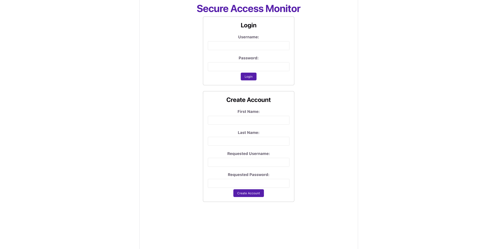
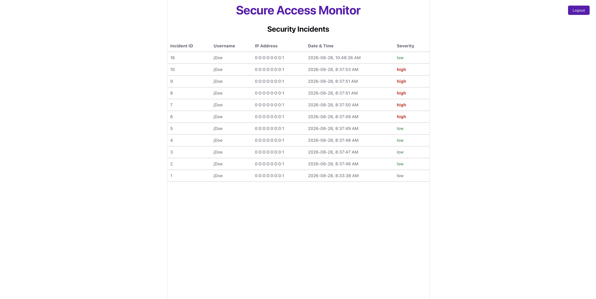

# Secure Access Monitor
This is a full-stack security monitoring web application built with React, Java, Spring Boot, and PostgreSQL.
The platform allows users to register and log in while monitoring authentication activity.
Failed login attempts are recorded and generate security incidents with severity grading.
The purpose of this project is to learn elements of the Spring platform and React to build a real world application to foster learning beyond the fixed academic structure of Java + Eclipse exlusive assignments.

## Screenshots
### Login and Registration

### Security Incident Dashboard

